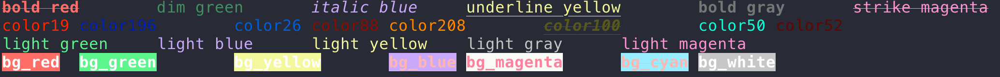

# chalks
终端粉笔

效果图:


示例代码:

```c++
#include "chalks/chalks.hpp"
#include <iostream>
using chalks::chalk;
using chalks::chalk_style;
using std::cout;
using std::endl;

int main(int argc, char const *argv[]) {
  cout << chalk("bold red", chalk_style().bold().red()) << "\t"
       << chalk("dim green", chalk_style().dim().green()) << "\t"
       << chalk("italic blue", chalk_style().italic().blue()) << "\t"
       << chalk("underline yellow", chalk_style().underline().yellow()) << "\t"
       << chalk("bold gray", chalk_style().bold().gray24()) << "\t"
       << chalk("strike magenta", chalk_style().strike().magenta()) << endl
       << chalk("color19", chalk_style().color256(196)) << "\t"
       << chalk("color196", chalk_style().color256(19)) << "\t"
       << chalk("color26", chalk_style().color256(26)) << "\t"
       << chalk("color88", chalk_style().color256(88)) << "\t"
       << chalk("color208", chalk_style().color256(208)) << "\t"
       << chalk("color100", chalk_style().color256(100)) << "\t"
       << chalk("color50", chalk_style().color256(50)) << "\t"
       << chalk("color52", chalk_style().color6x6x6(1, 0, 0)) << "\t" << endl
       << chalk("light green", chalk_style().green(true)) << "\t"
       << chalk("light blue", chalk_style().blue(true)) << "\t"
       << chalk("light yellow", chalk_style().yellow(true)) << "\t"
       << chalk("light gray", chalk_style().gray24(4)) << "\t"
       << chalk("light magenta", chalk_style().magenta(true)) << endl
       << chalk("bg_red", chalk_style().bold().bg_red()) << "\t"
       << chalk("bg_green", chalk_style().bold().bg_green()) << "\t"
       << chalk("bg_yellow", chalk_style().bold().bg_yellow()) << "\t"
       << chalk("bg_blue", chalk_style().bold().bg_blue()) << "\t"
       << chalk("bg_magenta", chalk_style().bold().bg_magenta()) << "\t"
       << chalk("bg_cyan", chalk_style().bold().bg_cyan()) << "\t"
       << chalk("bg_white", chalk_style().bold().bg_white()) << endl;
  return 0;
}

```
